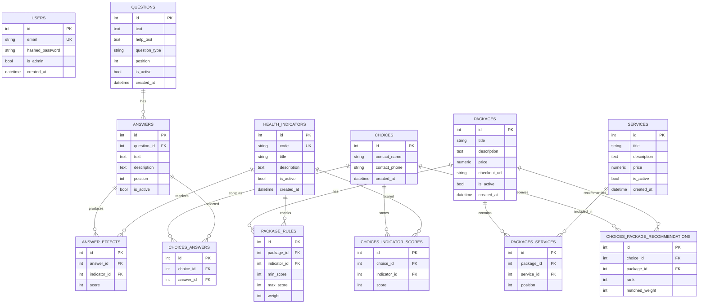

# Архитектура базы данных

## ERD-диаграмма



## Описание связей

### Questions -> Answers

Один вопрос содержит несколько вариантов ответа.

```text
Имеете ли вы лишний вес?
  Нет
  Немного
  Есть
  Сильный
```

### Answers -> AnswerEffects

Один ответ может содержать несколько эффектов. Эффект показывает, какой индикатор изменяется и сколько баллов добавляется.

```text
Ответ: "Плохой сон"
  Сон +2
  Стресс +1
```

### HealthIndicators -> AnswerEffects

Один медицинский индикатор может получать баллы от разных ответов и разных вопросов.

```text
Индикатор: Риск диабета
  +1 от ответа про наследственность
  +2 от ответа про лишний вес
```

### Packages -> PackageRules

Один пакет содержит несколько правил подбора.

```text
Пакет: Диабет-скрининг
  Риск диабета >= 2
  Лишний вес >= 2
```

### HealthIndicators -> PackageRules

Каждое правило проверяет значение конкретного индикатора. Вопросы и ответы напрямую с пакетами не связаны.

### Choices -> ChoicesAnswers

`Choice` - одно полное прохождение опроса пользователем. Оно содержит выбранные ответы.

```text
Прохождение #1:
  Вопрос про вес -> "Есть"
  Вопрос про сон -> "Плохой сон"
```

### Answers -> ChoicesAnswers

Таблица `choices_answers` хранит ссылки на ответы, выбранные в конкретном прохождении.

### Choices -> ChoicesIndicatorScores

После завершения опроса система суммирует эффекты ответов и сохраняет итоговые баллы индикаторов.

```text
Прохождение #1:
  Лишний вес = 2
  Сон = 2
  Стресс = 1
```

### HealthIndicators -> ChoicesIndicatorScores

Каждая итоговая оценка относится к одному индикатору.

### Packages -> PackagesServices -> Services

Услуги хранятся структурированно. Один пакет может содержать несколько услуг, а одна услуга может входить в разные пакеты. Общая цена пакета хранится отдельно от необязательных цен отдельных услуг.

### Choices -> ChoicesPackageRecommendations

После анализа система сохраняет несколько подходящих пакетов в порядке релевантности. У каждой рекомендации есть позиция `rank` и сумма весов совпавших правил `matched_weight`.

### Users

Отдельная таблица администраторов. Админы входят в систему и управляют вопросами, ответами, эффектами, индикаторами и пакетами. С прохождениями пользователей она напрямую не связана.

## Поток анализа

```text
Вопросы
  -> выбранные ответы
  -> эффекты ответов
  -> итоговые баллы индикаторов
  -> проверка правил пакетов
  -> ранжированный список рекомендованных пакетов
```

## Нормализация

Модель соответствует третьей нормальной форме (3NF):

- связи many-to-many вынесены в отдельные таблицы;
- вопросы и ответы напрямую не связаны с пакетами;
- услуги пакетов вынесены в отдельный справочник;
- в `choices_answers` не хранится `question_id`, потому что вопрос определяется через `answer_id`;
- общий балл прохождения не хранится отдельно, а вычисляется из `choices_indicator_scores`.

`choices_indicator_scores` хранит снимок результата анализа на момент прохождения опроса. Это позволяет сохранить историю, даже если администратор позднее изменит эффекты ответов.

## Redis-кеш

Публичная анкета кешируется в Redis:

```text
GET /api/v1/public/questions
  -> Redis: public:questions:v1
  -> при отсутствии ключа читаем PostgreSQL
  -> сохраняем публичный JSON в Redis на 600 секунд
```

После создания, изменения или удаления вопроса или ответа ключ удаляется. При недоступности Redis публичный API продолжает работать через PostgreSQL.
